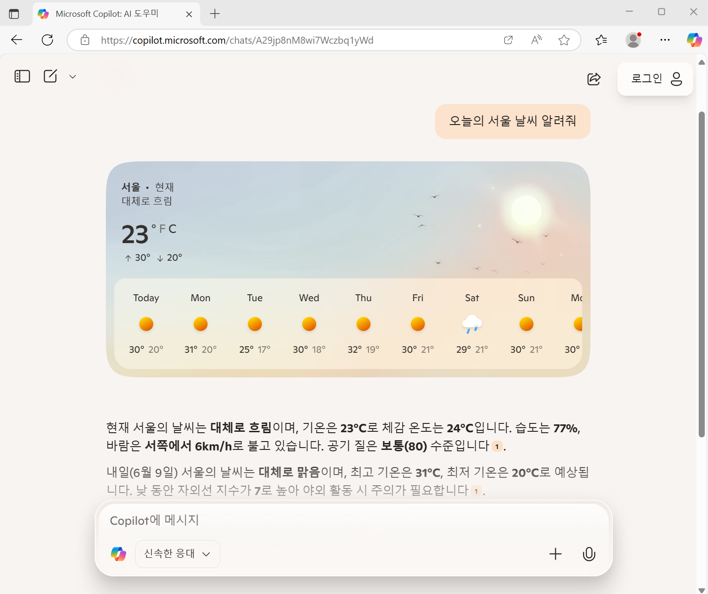
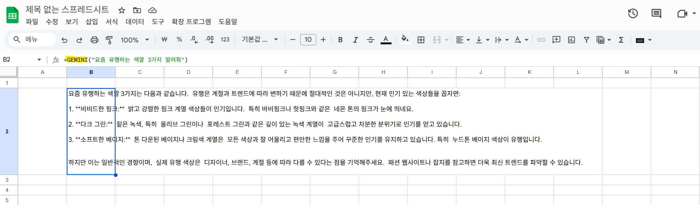
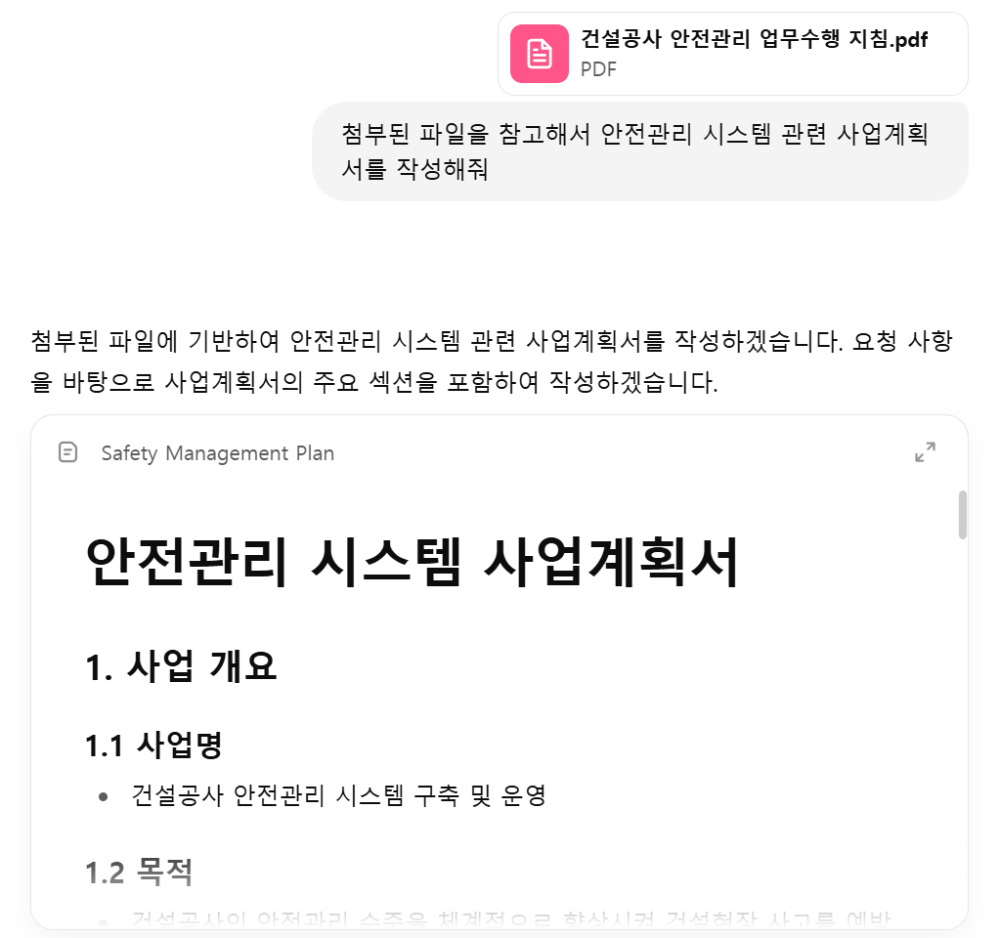
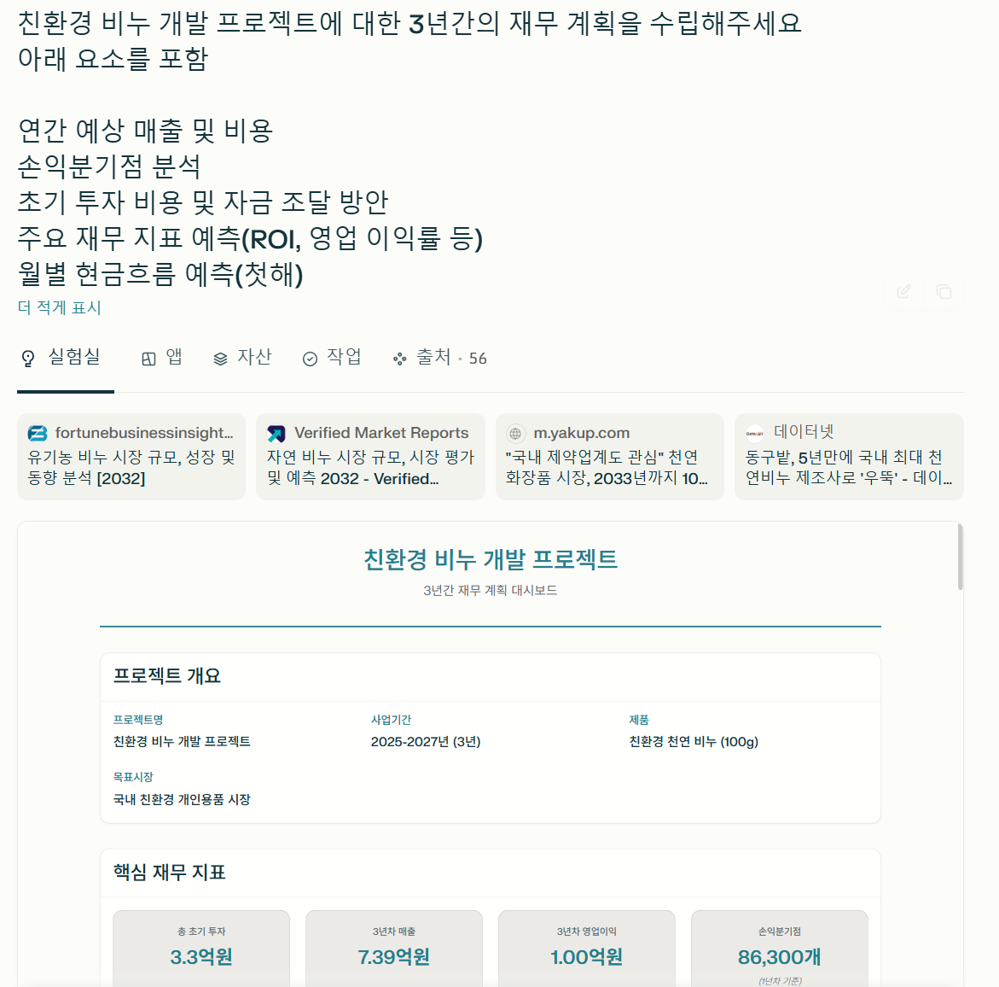
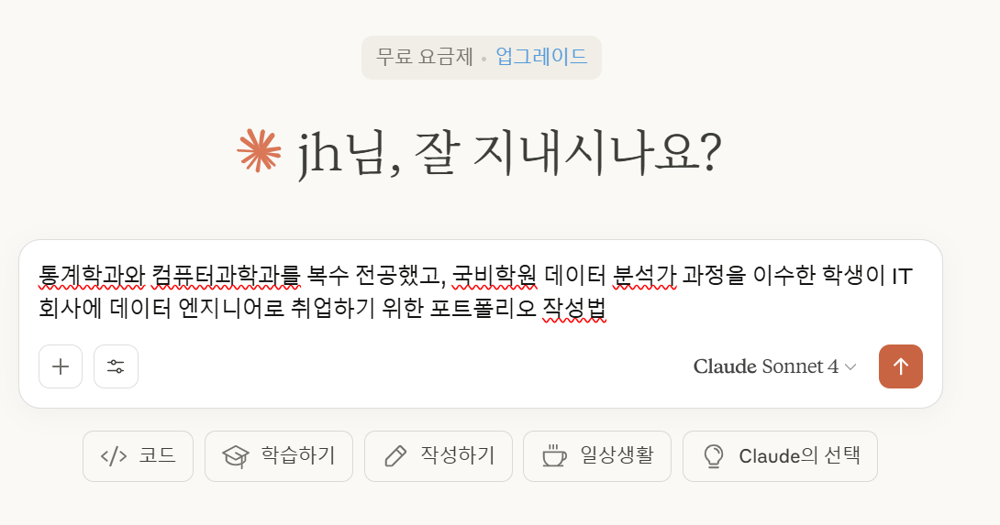
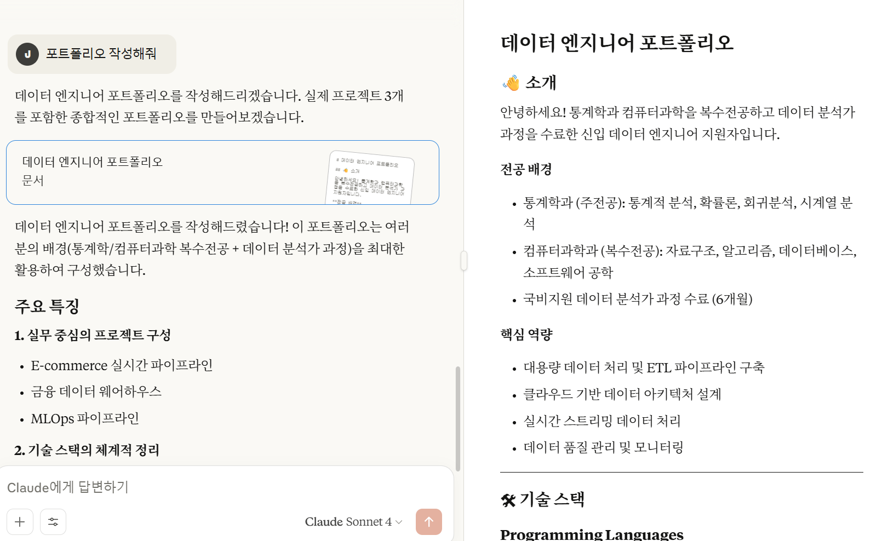
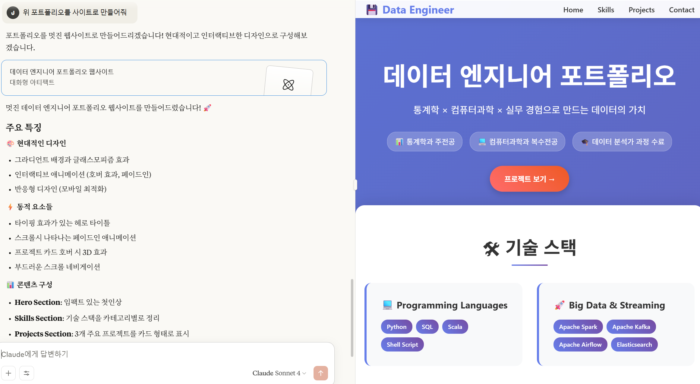

# KNOU
## 1강. 생성 AI와 프롬프트 엔지니어링
* Microsoft Copilot 이용해보기

  
## 2강. 다양한 교육 자료 생성  
* PPT: [Brisk로 생성한 프레젠테이션](2강%20생성%20Presentation.pdf)
* 퀴즈: https://forms.gle/8KAuLzQPLhKLAJzt7
* 자료: [Brisk로 생성한 리소스](양자역학%20-%20리소스.pdf)

## 3강. 자료 조사 및 보고서 작성  
[Perplexity로 생성한 보고서-친환경 비누 산업의 최근 5년간 트렌드 분석](친환경%20비누%20산업의%20최근%205년간%20트렌드%20분석.pdf)  

## 4강. 신제품 소개 프레젠테이션 및 안내자료 제작
* 링크 공유 버전: https://gamma.app/docs/Untitled-soeequ3r6ntl4x4  
* 파일 버전: [Gamma로 생성한 PPT 자료](4강%20프레젠테이션%20생성.pdf)

## 5강. 생성 AI API를 활용한 엑셀 업무 자동화  
* 엑셀 스프레드 시트에서 gemini 도구 사용해보기

## 6강. 생성 AI를 활용한 다양한 문서 생성  
* Chat gpt를 이용해 지침을 참고한 사업계획서 작성하기

* Perplexity를 이용해 재무 계획표 작성하기

[생성된 자료: 친환경 비누 개발 프로젝트 3년간 재무 계획](친환경_비누_개발_프로젝트_3년간_재무_계획.pdf)

* Claude를 이용해 포트폴리오 작성하기

## 7강. 생성 AI 활용 코드 작성 및 시뮬레이션  

## 8강. 마케팅 자료 제작  

## 9강. 홍보영상 제작  

## 10강. e-브로슈어 제작
